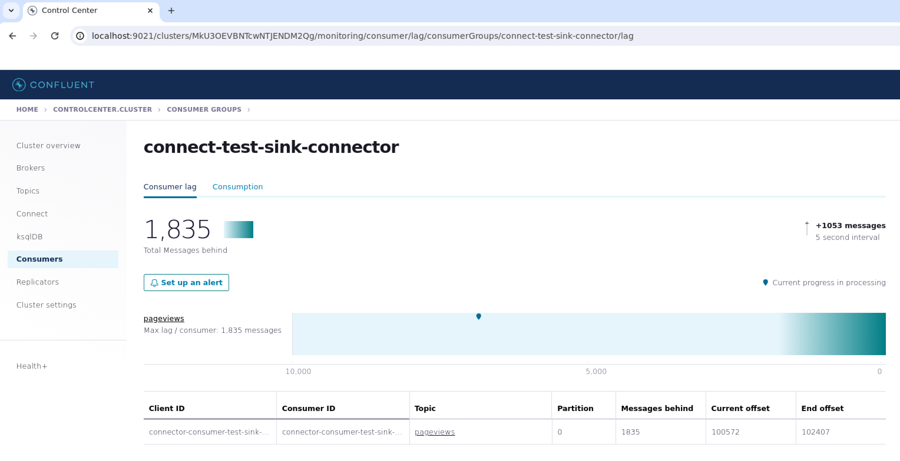

<div align="center">
  <picture>
    <source srcset="assets/kafka+regatta-dark.png" media="(prefers-color-scheme: dark)">
    <source srcset="assets/kafka+regatta-light.png" media="(prefers-color-scheme: light)">
    
  </picture>
</div>

# Kafka to Regatta Cluster via Sink Connector

This project demonstrates how to connect a Docker-based Kafka Cluster to a Regatta Cluster using a Kafka Sink Connector.

**Note:** This setup uses a local, dockerized Kafka cluster instead of Kafka Cloud services. It can be deployed on any virtual machine (VM).

---

## Prerequisites
- Regatta Sink Connector JAR file
- Docker and Docker Compose installed
- Access to the Regatta Platform

---

## Setup Instructions

### 1. Create a Regatta Cluster
1. **Log in to the [Regatta Platform](https://cloud.regatta.dev/).**
   - Use your credentials or Google SSO if applicable.
2. **Create a New Cluster:**
   - Click "**+ CREATE NEW CLUSTER**".
   - Configure the cluster:
     - **Cluster Name:** Enter a meaningful name.
     - **Cluster Type:** Select the appropriate type.
   - Click "**Confirm**".
3. **Wait for the Cluster to Start Running.**

### 2. Clone the Repository
```bash
git clone git@github.com:Regatta-Dev/kafka-sink-app.git
cd kafka-sink-app
```

### 3. Add the Regatta Sink Connector
Place the Regatta Sink Connector JAR file in the repository folder.

### 4. Configure `sink.json`
Update the `sink.json` file:
- Set the `url` field to your cluster’s **IP:PORT** (found in the Regatta Platform).
- Add your `username` and `password`. Contact Regatta support if credentials are unavailable.
- Configure device names if needed.

### 5. Build the Docker Compose Setup
```bash
docker-compose build
```

### 6. Start Docker Services
```bash
docker-compose up -d
```

### 7. Copy the Sink Connector to Kafka Connect
Replace `SINK_CONNECTOR_VERSION` with the actual version:
```bash
docker cp regatta-sink-connector-{SINK_CONNECTOR_VERSION}-shaded_full.jar connect:/usr/share/java/
```

### 8. Restart Kafka Connect
```bash
docker restart connect
```

### 9. Verify Kafka Connect API
```bash
curl http://localhost:8083/connectors
```
Expected output:
```json
[]
```

### 10. Launch Datagen Source Connector
Start the Source Connector:
```bash
curl -X POST -H "Content-Type: application/json" --data @./datagen.json http://localhost:8083/connectors
```
Example output:
```json
{"name":"datagen-pageviews","config":{"connector.class":"io.confluent.kafka.connect.datagen.DatagenConnector","kafka.topic":"pageviews", ...}}
```

### 11. Launch the Sink Connector
```bash
curl -X POST -H "Content-Type: application/json" --data @./sink.json http://localhost:8083/connectors
```
Expected output:
```json
{"name":"test-sink-connector","config":{"connector.class":"dev.regatta.sinkConnector.RegSinkConnector", ...}}
```

### 12. Open the Kafka Control Center (Optional)
1. Open your browser and navigate to the Kafka Control Center URL on the VM hosting the Kafka cluster:
```
http://localhost:9021/
```
2. Go to "Consumers" and click on your consumer, e.g., "connect-test-sink-connector".
3. View the consumed records being transferred from the Kafka cluster to the Regatta cluster.

<div align="center">
  
</div>

### 13. Verify Data in Regatta
Run a query to confirm that the data was successfully processed:
```sql
SELECT COUNT(*) FROM pageviews;
```
Example output:
```
1000000
```

---

## Limitations
- **Insert-only Support:** Currently, only insert operations are supported.
- **Delivery Guarantee:** Supports "at least once" delivery.
- **Record Format:** Only AVRO is supported.

---

© 2024 Regatta Team

